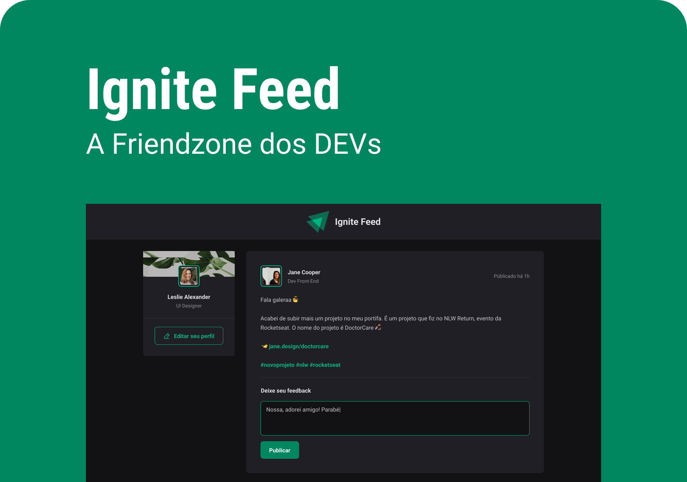

<h1 align="center">IgniteFeed</h1>

Erick Marques Cabral

Esse projeto exclusivo e gratuito, promovido pela Rocketseat para ensino de tecnologias WEB.  
<a href="https://www.rocketseat.com.br/">Rocketseat🔗</a>.

  

  <a href="#-descrição">Descrição do Projeto</a>&nbsp;&nbsp;&nbsp;|&nbsp;&nbsp;&nbsp;
  <a href="#-tecnologias">Tecnologias</a>&nbsp;&nbsp;&nbsp;|&nbsp;&nbsp;&nbsp;
  <a href="#-layout">Layout</a> 

  

## 💻 Descrição
Nesse projeto, desenvolvi uma aplicação simples para meu portifólio, que contém as seguintes funcionalidades:

- Adicionar uma novo comantário
- Excluir um comentário
- Listar comentário

Apesar de serem poucas funcionalidades, precisei abordar conceitos como:

- Estados
- Imutabilidade do estado
- Listas e chaves no ReactJS
- Propriedades
- Componentização

## 🚀 Tecnologias
Esse projeto foi desenvolvido com as seguintes tecnologias:

- HTML e CSS
- JavaScript
- Git e Github
- Figma
- Vite
- TypeScript
- ReactJS
    
## 🔖 Layout

Você pode visualizar o layout do projeto através [DESSE LINK](https://www.figma.com/file/IwwtoYQUFWgb6wtK0NJvTe/Ignite-Feed?node-id=26%3A12&t=Q3gectzOaVmh2exZ-1). É necessário ter conta no [Figma](https://figma.com) para acessá-lo.
